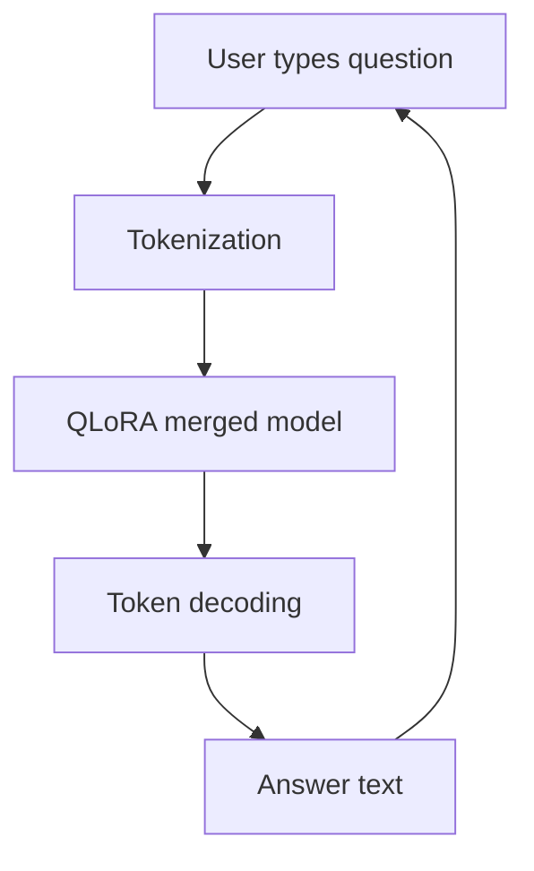
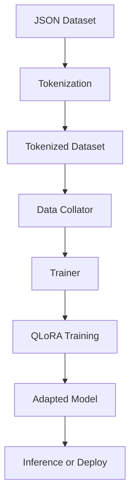
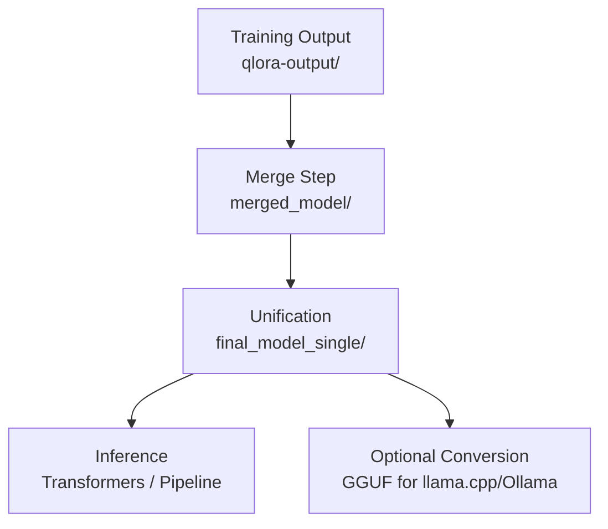

# Efficient QLoRA Fine-Tuning on Oracle Cloud NVIDIA GPUs

## 🎯 Introduction

Training large language models (LLMs) from scratch is unfeasible for most people, as it requires hundreds of GPUs and billions of tokens. On Oracle Cloud Infrastructure (OCI), however, you can leverage powerful NVIDIA GPUs—such as the A10 or A100—to adapt pre-trained models (like Mistral-7B) for your own use cases. By applying lightweight techniques such as LoRA and QLoRA, you only train a fraction of the parameters while using 4-bit quantization to drastically reduce memory requirements. This approach makes fine-tuning on enterprise-grade GPUs in the cloud both cost-effective and scalable, whether for experimentation on a single RTX GPU or for distributed training across clustered NVIDIA accelerators.
### Real Applications

- Specialized chatbots: healthcare, legal, finance.

- Question and Answer (QA) systems over document bases.

- Business automation: agents that understand internal processes.

- Academic research: summarization and analysis of technical articles.

In this tutorial, you will learn how to fine-tune a Mistral 7B model with QLoRA using a local JSON dataset of questions and answers.

## 🧩 Key Concepts

- **BitsAndBytes (bnb):** library for 4-bit quantization, enabling training of large models on a single modern GPU.

- **LoRA (Low-Rank Adaptation):** technique that adds lightweight learning layers without modifying the original weights.

- **QLoRA:** combination of LoRA + 4-bit quantization, resulting in efficient and accessible fine-tuning.

- **Trainer (Hugging Face):** abstraction that manages dataset, batches, checkpoints, and metrics automatically.

- **JSON dataset:** in the expected format, each entry should have a "text" field containing the instruction or training data.

## ⚙️ Prerequisites

Install required packages:
```bash
pip install torch transformers datasets peft bitsandbytes accelerate
```

Download a training dataset in JSON format like this format:
```json
[
  {"text": "Question: What is QLoRA?\nAnswer: An efficient fine-tuning technique using 4-bit quantization."},
  {"text": "Question: Who created the Mistral model?\nAnswer: The company Mistral AI."}
]
```

Save as ./datasets/qa_dataset.json.

## ⚡ GPU Compatibility and Recommendations

Running and fine-tuning large language models is computationally intensive. While it is possible to execute inference on CPUs, performance is significantly slower and often impractical for real-time or large-scale workloads. For this reason, using a dedicated GPU is strongly recommended.

### Why GPUs?

GPUs are optimized for massively parallel matrix operations, which are at the core of transformer models. This parallelism translates directly into:

Faster training and inference — models that would take hours on CPU can be executed in minutes on GPU.

Support for larger models — GPUs provide high-bandwidth memory (VRAM), enabling models with billions of parameters to fit and run efficiently.

Energy efficiency — despite high TDPs, GPUs often consume less power per token generated than CPUs, thanks to their optimized architecture.

### Why NVIDIA?

Although other vendors are entering the AI market, NVIDIA GPUs remain the de-facto standard for LLM training and deployment because:

They offer CUDA and cuDNN, mature software stacks with deep integration into PyTorch, TensorFlow, and Hugging Face Transformers.

Popular quantization and fine-tuning libraries (e.g., BitsAndBytes, PEFT, Accelerate) are optimized for NVIDIA architectures.

Broad ecosystem support ensures driver stability, optimized kernels, and multi-GPU scalability.

### Examples of GPUs

Consumer RTX Series (e.g., RTX 3090, 4090, 5090):
These GPUs are widely available, offering 16–24 GB VRAM (3090/4090) or more in newer generations like the RTX 5090. They are suitable for personal or workstation setups, providing excellent performance for inference and QLoRA fine-tuning.

Data Center GPUs (e.g., NVIDIA A10, A100, H100):
Enterprise GPUs are designed for continuous workloads, offering higher VRAM (24–80 GB), ECC memory for reliability, and optimized virtualization capabilities. For example:

An A10 (24 GB) is an affordable option for cloud deployments.

An A100 (40–80 GB) or H100 supports massive batch sizes and full fine-tuning of very large models.

### Clusters and Memory Considerations

VRAM capacity is the main limiting factor. A 7B parameter model typically requires ~14–16 GB in FP16, but can run on ~8 GB when quantized (e.g., 4-bit QLoRA). Larger models (13B, 34B, 70B) may require 24 GB or more.

Clustered GPU setups (multi-GPU training) enable splitting the model across devices using tensor or pipeline parallelism. This is essential for very large models but introduces complexity in synchronization and scaling.

Cloud providers often expose A10, A100, or L4 instances that scale horizontally. Choosing between a single powerful GPU and a cluster of smaller GPUs depends on workload:

Single GPU: simpler setup, fewer synchronization bottlenecks.

Multi-GPU cluster: better for large-scale training or serving multiple requests concurrently.

### Summary

For most developers:

RTX 4090/5090 is an excellent choice for local fine-tuning and inference of 7B–13B models.

A10/A100 GPUs are better suited for enterprise clusters or cloud deployments, where high availability and VRAM capacity matter more than cost.

When planning GPU resources, always balance VRAM requirements, throughput, and scalability needs. Proper hardware selection ensures that training and inference are both feasible and efficient.


## 📝 Step-by-step code

This step-by-step pipeline is organized to keep **memory usage low**
while preserving model quality and reproducibility:

-   **Quantization first (4-bit with BitsAndBytes)** reduces VRAM so you
    can load a 7B model on a single modern GPU without sacrificing too
    much accuracy. Then we layer **LoRA adapters** on top, updating only
    low-rank matrices instead of full weights --- which dramatically
    cuts the number of trainable parameters and speeds up training.\
-   We explicitly **set the tokenizer's `pad_token` to `eos_token`** to
    avoid padding issues with causal LMs and keep batching simple and
    efficient.\
-   Using **`device_map="auto"`** delegates placement (GPU/CPU/offload)
    to Accelerate, ensuring the model fits while exploiting available
    GPU memory.\
-   The **data pipeline** keeps labels equal to inputs for next-token
    prediction and uses a **LM data collator** (no MLM), which is the
    correct objective for decoder-only transformers.\
-   **Trainer** abstracts the training loop (forward, backward,
    optimization, logging, checkpoints), reducing boilerplate and
    error-prone code.

### 🏗️ Training Architecture (End-to-End)

``` mermaid
flowchart LR
  A[A-Raw JSON Dataset] --> B[B-Tokenization & Formatting]
  B --> C[C-4-bit Quantized Base Model]
  C --> D[D-LoRA Adapters PEFT]
  D --> E[E-Trainer Loop FP16/4-bit]
  E --> F[F-Checkpoints qlora-output]
  F --> G[G-Merge Adapters → Base]
  G --> H[H-Unified Export safetensors]
  H --> I[I-Inference Transformers or GGUF Ollama/llama.cpp]
```



-   **C → D**: Only LoRA layers are trainable; the base model stays
    quantized/frozen.
-   **F → G → H**: After training, you **merge** LoRA into the base,
    then **export** to a production-friendly format (single or sharded
    `safetensors`) or convert to **GGUF** for lightweight runtimes.

### 🚶 The core steps (and why each matters)

1.  **Main configurations** --- Centralize base model, dataset path,
    output directory, and sequence length so experiments are
    reproducible and easy to tweak.
2.  **Quantization with BitsAndBytes (4-bit)** --- Shrinks memory
    footprint and bandwidth pressure; crucial for single-GPU training.
3.  **Load tokenizer & model** --- Set `pad_token = eos_token` (causal
    LM best practice) and let `device_map="auto"` place weights
    efficiently.
4.  **Prepare LoRA (PEFT)** --- Target attention projections (`q_proj`,
    `k_proj`, `v_proj`, `o_proj`) for maximal quality/latency gains per
    parameter trained.
5.  **Dataset & tokenization** --- Labels mirror inputs for next-token
    prediction; truncation/padding give stable batch shapes.
6.  **Data collator (no MLM)** --- Correct objective for decoder-only
    models; ensures clean, consistent batches.
7.  **Training arguments** --- Small batch + gradient accumulation
    balances VRAM limits with throughput; `fp16=True` saves memory.
8.  **Trainer** --- Handles the full loop
    (forward/backward/optim/ckpts/logging) to reduce complexity and
    bugs.\
9.  **Train & save** --- Persist adapters, PEFT config, and tokenizer
    for later merge or continued training.
10. **(Post) Merge & export** --- Fuse adapters into the base, export to
    `safetensors`, or convert to **GGUF** for Ollama/llama.cpp if you
    need a single-file runtime.


1. Main configurations
   
```python
model_name = "mistralai/Mistral-7B-Instruct-v0.2"
data_file_path = "./datasets/qa_dataset.json"
output_dir = "./qlora-output"
max_length = 512
```

Defines base model, dataset, output, and token limit per sample.

2. Quantization with BitsAndBytes

```python
bnb_config = BitsAndBytesConfig(
   load_in_4bit=True,
   bnb_4bit_use_double_quant=True,
   bnb_4bit_quant_type="nf4",
   bnb_4bit_compute_dtype="float16"
)
```

Activates 4-bit quantization (nf4) to reduce memory.

3. Model and tokenizer loading
   
```python
tokenizer = AutoTokenizer.from_pretrained(model_name, trust_remote_code=True)
tokenizer.pad_token = tokenizer.eos_token

model = AutoModelForCausalLM.from_pretrained(
   model_name,
   quantization_config=bnb_config,
   device_map="auto",
   trust_remote_code=True
)
```

Defines pad_token equal to eos_token (needed in causal models).

Loads the quantized model.

4. Preparing for LoRA

```python
model = prepare_model_for_kbit_training(model)

peft_config = LoraConfig(
   r=8,
   lora_alpha=16,
   target_modules=["q_proj", "k_proj", "v_proj", "o_proj"],
   lora_dropout=0.05,
   bias="none",
   task_type="CAUSAL_LM"
)
model = get_peft_model(model, peft_config)
```

Configures LoRA layers only on attention projections.

5. Loading and tokenizing the dataset

```python
dataset = load_dataset("json", data_files=data_file_path, split="train")

def tokenize(example):
    tokenized = tokenizer(
        example["text"],
        truncation=True,
        max_length=max_length,
        padding="max_length"
    )
    tokenized["labels"] = tokenized["input_ids"].copy()
    return tokenized

tokenized_dataset = dataset.map(tokenize, remove_columns=dataset.column_names)
```

Tokenizes entries, sets labels equal to input_ids.

6. Data Collator

```python
data_collator = DataCollatorForLanguageModeling(tokenizer=tokenizer, mlm=False)
```

Ensures consistent batches without masking (MLM disabled).

7. Training arguments

```python
training_args = TrainingArguments(
   output_dir=output_dir,
   per_device_train_batch_size=2,
   gradient_accumulation_steps=4,
   num_train_epochs=3,
   learning_rate=2e-4,
   fp16=True,
   logging_steps=10,
   save_strategy="epoch",
   report_to="none"
)
```

Small batch size (2), accumulating gradients to effective batch of 8.

fp16 enabled to reduce memory.

8. Initializing the Trainer

```python
trainer = Trainer(
   model=model,
   args=training_args,
   train_dataset=tokenized_dataset,
   data_collator=data_collator
)
```

Trainer organizes training, checkpoints, and logging.

9. Running the training

```python
trainer.train()
model.save_pretrained(output_dir)
tokenizer.save_pretrained(output_dir)
```

Saves adapted model in qlora-output.

### 🚀 Expected result

After training, you will have:

- An adapted model for your domain (./qlora-output).

- Ability to run specific inferences using:

```python
from transformers import pipeline
pipe = pipeline("text-generation", model="./qlora-output", tokenizer="./qlora-output")
print(pipe("Question: What is QLoRA?\nAnswer:")[0]["generated_text"])
```

## Complete QLoRA Pipeline

So far we have seen model configuration, quantization, LoRA application, and dataset preparation.

Now let's understand what happens afterwards:

1. Data Collator

```python
data_collator = DataCollatorForLanguageModeling(tokenizer=tokenizer, mlm=False)
```

### 📌 Why use it?

The Data Collator is responsible for dynamically building batches during training.

In causal models, we do not use MLM (Masked Language Modeling) as in BERT, so we set mlm=False.

2. Training Arguments

```python
training_args = TrainingArguments(
   output_dir=output_dir,
   per_device_train_batch_size=2,
   gradient_accumulation_steps=4,
   num_train_epochs=3,
   learning_rate=2e-4,
   fp16=True,
   logging_steps=10,
   save_strategy="epoch",
   report_to="none"
)
```

### 📌 Why configure this?

- per_device_train_batch_size=2 → limits batch size (GPU constraint).

- gradient_accumulation_steps=4 → accumulates gradients before update → effective batch = 2 x 4 = 8.

- num_train_epochs=3 → trains dataset 3 times.

- learning_rate=2e-4 → adequate LR for LoRA.

- fp16=True → saves VRAM.

- logging_steps=10 → logs every 10 batches.

- save_strategy="epoch" → saves checkpoint after each epoch.

- report_to="none" → avoids external integrations.

3. Defining Trainer

```python
trainer = Trainer(
   model=model,
   args=training_args,
   train_dataset=tokenized_dataset,
   data_collator=data_collator
)
```

### 📌 Why use Trainer?

Trainer automates:

- Forward pass (batch propagation).

- Backpropagation (gradient calculation).

- Weight optimization.

- Logging and checkpoints.

4. Running Training

```python
trainer.train()
```

### 📌 What happens here?

Trainer processes data, batches, loss calculation, weight updates.

Only LoRA layers are updated.

5. Saving Adapted Model

```python
model.save_pretrained(output_dir)
tokenizer.save_pretrained(output_dir)
```

### 📌 Why save?

The ./qlora-output/ directory will contain:

- LoRA weights (adapter_model.bin).

- PEFT config (adapter_config.json).

- Adapted tokenizer.

This output can be loaded later for inference or further training.

## Interactive Inference

After training with QLoRA, we usually merge LoRA weights into the base model.

The code below shows how to load the merged model and use it interactively.

```python
# -*- coding: utf-8 -*-
import torch
from transformers import AutoTokenizer, AutoModelForCausalLM
from accelerate import init_empty_weights, load_checkpoint_and_dispatch

# auto, mps, cuda
gpu="cuda"

MODEL_PATH = "./merged_model"

tokenizer = AutoTokenizer.from_pretrained(MODEL_PATH, trust_remote_code=True)
tokenizer.pad_token = tokenizer.eos_token

model = AutoModelForCausalLM.from_pretrained(
   MODEL_PATH,
   device_map=gpu,
   offload_folder="./offload",
   torch_dtype=torch.float16
)
model.eval()
```

### Function to generate

```python
def generate_answer(prompt, max_new_tokens=64):
    inputs = tokenizer(prompt, return_tensors="pt")
    inputs = {k: v.to(gpu) for k, v in inputs.items()}
    with torch.no_grad():
        outputs = model.generate(
            **inputs,
            max_new_tokens=max_new_tokens,
            do_sample=False  # faster and deterministic
        )
    return tokenizer.decode(outputs[0], skip_special_tokens=True)
```

### Interactive loop

```python
if __name__ == "__main__":
    print("🤖 Model loaded! Type your question or 'exit' to quit.")
    while True:
        question = input("\n📝 Instruction: ")
        if question.strip().lower() in ["exit", "quit"]:
            break

        formatted = f"### Instruction:\n{question}\n\n### Answer:"
        answer = generate_answer(formatted)
        print("\n📎 Answer:")
        print(answer)
```

## 📊 Inference Flow



## ✅ Conclusion of Inference

- This stage validates if the model learned the desired domain.

- Can be expanded to:

  - Flask/FastAPI APIs.

  - Chatbots (web interfaces).

  - Corporate integration (API Gateway, MCP servers).


📊 Full Pipeline Summary



## 🔄 Post-training: Merge and Unified Model Export

After training with QLoRA, the adapter weights are saved in the `./qlora-output/` folder.  
However, these are not directly usable for inference in production. The next step is to **merge** the LoRA adapters with the base model and then export them into a format ready for inference.

### 1. Merge Stage
The merging process fuses the LoRA adapter weights into the original Mistral 7B model.  
This produces a `./merged_model/` directory that contains the complete model weights in shards (e.g., `pytorch_model-00001-of-000xx.bin`).

### 2. Unification into Hugging Face format
To simplify inference, we can re-export the model into a **Hugging Face-compatible format** that uses the `safetensors` standard.  
In this step, we obtain a folder such as `./final_model_single/` containing:

- `model.safetensors` (the consolidated weights, possibly in one large file or multiple shards depending on size)  
- `config.json`, `generation_config.json`  
- Tokenizer files (`tokenizer.json`, `tokenizer_config.json`, `special_tokens_map.json`, etc.)

⚠️ Note: although this looks like a "single model", Hugging Face does not bundle tokenizer and weights into a single binary. The folder still contains multiple files.  
If you want a **truly single-file format** (weights + tokenizer + metadata in one blob), you should convert the model to **GGUF**, which is the standard used by `llama.cpp` and `Ollama`.

### 3. Alternative Inference with Unified Files
Once exported, you can load the model for inference like this:

```python
from transformers import AutoTokenizer, AutoModelForCausalLM

model_dir = "./final_model_single"

tokenizer = AutoTokenizer.from_pretrained(model_dir, trust_remote_code=True)
model = AutoModelForCausalLM.from_pretrained(
    model_dir,
    torch_dtype="float16",
    device_map="auto",
    trust_remote_code=True
)
```



## 🗜️ Conversion to GGUF (Optional)

Although the Hugging Face format (`safetensors` + config + tokenizer) is widely supported, it still requires multiple files.  
If you prefer a **true single-file model** that bundles weights, tokenizer, and metadata, you can convert the model to **GGUF** — the format used by `llama.cpp`, `Ollama`, and other lightweight inference engines.

### 1. Install llama.cpp
Clone the repository and build it:

```bash
git clone https://github.com/ggerganov/llama.cpp
cd llama.cpp
make

### 2. Convert Hugging Face model to GGUF

Use the conversion script provided in llama.cpp:

```python
python3 convert.py ./final_model_single --outfile mistral-qlora.gguf
```

This will generate a single GGUF file (e.g., mistral-qlora.gguf) containing all weights and tokenizer data.

### 3. Run inference with llama.cpp

You can now run the model with:

```bash
./main -m mistral-qlora.gguf -p "Explain what OMOP CDM is in a few sentences."
```

### 4. Run with Ollama

If you prefer Ollama, place the .gguf file in your Ollama models directory and create a Modelfile:

```docker
FROM mistral-qlora.gguf
```

Then run:

```bash
ollama create mistral-qlora -f Modelfile
ollama run mistral-qlora
```

>**Note:**
	GGUF models are quantized (e.g., Q4_K_M, Q5_K_M, Q8_0) to reduce size and run efficiently on consumer GPUs or CPUs.	
	The resulting .gguf file will be much smaller (often 4–8 GB) compared to the 28 GB FP16 Hugging Face export.
	

## ✅ Final Conclusion

- This tutorial showed:

  - How to apply QLoRA on large models.

  - How to train on consumer GPUs with reduced memory.

  - How to adapt Mistral 7B for specialized Q&A.


👉 This technique can be extended to other datasets and domains such as banking, legal, or healthcare.

## References

[Deploy NVIDIA RTX Virtual Workstation on Oracle Cloud Infrastructure](https://docs.oracle.com/en/learn/deploy-nvidia-rtx-oci/index.html)


## Acknowledgments

- **Author** - Cristiano Hoshikawa (Oracle LAD A-Team Solution Engineer)
